# Money Labs - Competition Presentation (2.5 Minutes)

## 📊 Visual Deck Structure

### Slide 1: Problem Statement (0:00-0:30)
**Title:** "Financial Education is Broken"

**Visual Suggestions:**
- Split-screen: Traditional boring textbook vs. engaging game interface
- Animated stat counter: "75% fail basic financial literacy tests"
- Red X marks over: "Boring", "Intimidating", "Disconnected", "One-Size-Fits-All"

**Mermaid Diagram - Problem Flow:**

```mermaid
graph LR
    A[Traditional Finance Education] --> B[Boring Textbooks]
    A --> C[Intimidating Jargon]
    A --> D[No Real-Time Data]
    A --> E[Generic Advice]
    B --> F[❌ 75% Failure Rate]
    C --> F
    D --> F
    E --> F
    F --> G[💰 $30B Lost Annually]
    
    style A fill:#ff6b6b
    style F fill:#c92a2a
    style G fill:#e03131
```



**Talking Points:**
> "Let me ask you something - when was the last time you were *excited* about learning finance? For 75% of people, the answer is never. Traditional financial education is boring, intimidating, and completely disconnected from reality. While markets move in real-time, we're stuck reading decade-old textbooks. This isn't just frustrating - it's costing people $30 billion annually in bad investment decisions."

---

### Slide 2: Solution & Vision (0:30-1:00)
**Title:** "Money Labs: Where Finance Meets Fun"

**Visual Suggestions:**
- Hero shot of dashboard with animated components
- Icons representing: 🎯 Predictions, 🤖 AI Chat, 🏆 Gamification, 🎤 Voice AI
- Growth timeline visualization (Phase 1 → Phase 5)

**Mermaid Diagram - Product Architecture:**

```mermaid
graph TD
    A[Money Labs Platform] --> B[🎯 Daily Predictions]
    A --> C[🤖 AI Financial Advisor]
    A --> D[🏆 Gamification Engine]
    A --> E[🎤 Voice Interface]
    A --> F[📊 Portfolio Analysis]
    
    B --> G[Learn by Doing]
    C --> G
    D --> G
    E --> G
    F --> G
    
    G --> H[Financial Literacy Mastery]
    
    style A fill:#40c057
    style G fill:#51cf66
    style H fill:#37b24d
```



**Mermaid Diagram - Growth Roadmap:**


**Talking Points:**
> "Enter Money Labs. We've gamified financial education. Make daily predictions, earn points, level up. Chat with AI experts that explain Bitcoin like you're five. Analyze your portfolio with real-time data. We've got voice AI powered by Google Gemini - literally talk to your financial advisor. Our vision? Five phases: Start with core predictions, add mobile apps, build social competition, offer certifications, scale to 10 million users. We're targeting a $30B financial education market plus a $12B fintech opportunity."

---

### Slide 3: Live Demo (1:00-1:30)
**Title:** "See It In Action"

**Visual Suggestions:**
- Screen recording with smooth transitions
- Highlight interactive elements (buttons, animations)
- Show real prediction flow with timer
- Display leaderboard with animated rank changes

**Mermaid Diagram - User Flow:**


**Demo Flow:**
1. **Onboarding (10s)**: "Here's our onboarding - select your risk tolerance, pick your interests. Simple."
2. **Dashboard (10s)**: "Dashboard shows breaking alerts, daily quiz, price widgets. All personalized."
3. **AI Chat (5s)**: "Ask anything - 'Explain Bitcoin halving' - instant, personalized answer."
4. **Expert Panel (5s)**: "Get perspectives from Risk Manager, Day Trader, Long-term Investor - all AI-powered."

**Technical Highlight:**
> "Behind the scenes: 14 Supabase Edge Functions, real-time authentication, sophisticated RAG architecture. This isn't a prototype - it's production-ready."

---

### Slide 4: You.com Integration (1:30-2:00)
**Title:** "Powered by You.com - Real-Time Intelligence"

**Visual Suggestions:**
- Split diagram: "Before" (multiple API logos tangled) vs. "After" (clean You.com unified API)
- Animated data flow from You.com → RAG → User
- Live counter showing cache savings: "85% fewer API calls"

**Mermaid Diagram - RAG Architecture:**


**Mermaid Diagram - You.com Query Examples:**


**Mermaid Diagram - Caching Strategy:**


**Talking Points:**
> "Here's where You.com changes everything. Traditional finance platforms juggle 10 different APIs - Twitter, Reddit, news feeds, market data. It's expensive, complex, and fragile. You.com gives us one unified API for everything.

> Six features powered by You.com: Chat Analyst, Expert Panel, Social Pulse, Portfolio Analyzer, Market News, Breaking Alerts. Each query is augmented with context - like 'Bitcoin price prediction Reddit Twitter 2025' for social sentiment.

> Our RAG architecture: Pull user context from our database, fetch real-time data from You.com - 10 search results - synthesize with Lovable AI GPT-4, personalize the response. Then we cache it.

> Here's the innovation: Multi-tier caching. Social sentiment changes slowly - 4-hour cache. Portfolio analysis - 24-hour cache. Breaking alerts - real-time, no cache. Result? 85% reduction in You.com API calls. That's cost optimization AND speed optimization."

---

### Slide 5: Roadmap & Impact (2:00-2:30)
**Title:** "The Future of Financial Education"

**Visual Suggestions:**
- Animated world map showing user growth (1K → 10M)
- Timeline with milestone markers
- Impact metrics: "$300M saved", "10M educated", "100K certified"

**Mermaid Diagram - Quarterly Roadmap:**


**Mermaid Diagram - Impact Model:**


**Talking Points:**
> "Our roadmap: Q1 - virtual trading portfolios with paper money. Q2 - mobile apps and advanced analytics. Q3 - social competition and educational certifications you can put on LinkedIn. Long-term? 10 million users, international expansion, white-label solutions for schools and corporations.

> Why we'll win: Innovation - first RAG-powered financial education platform. Usability - gamification makes finance fun. Impact - targeting 10 million users in a $30B market. Feasibility - 14 working edge functions, real authentication, deployed and live. Technical excellence - sophisticated You.com integration with 85% cost optimization.

> This isn't just an app. It's a movement to democratize financial education. To make learning about money as addictive as scrolling social media. To turn financial literacy from a chore into an adventure.

> Money Labs: Where finance meets fun. Thank you."

---

## 📈 Presentation Cheat Sheet

### Key Stats to Memorize
- **75%** fail financial literacy tests
- **$30B** financial education market
- **14** Supabase Edge Functions
- **6** You.com-powered features
- **85%** reduction in API calls via caching
- **10M** target users by 2026

### Technical Highlights for Q&A

**RAG Architecture:**


**Sentiment Analysis Algorithm:**
```mermaid
flowchart TD
    A[Raw Text from You.com] --> B[Extract Keywords]
    B --> C{Analyze Sentiment}
    C -->|Bullish| D[Count: buy, moon, hodl, rally]
    C -->|Bearish| E[Count: sell, dump, crash, drop]
    D --> F[Calculate Percentage]
    E --> F
    F --> G[Bullish: 68%, Bearish: 32%]
    
    A --> H[Extract Price Targets]
    H --> I[Regex: /\$[\d,]+\.?\d*[KkMm]?/g]
    I --> J[Normalize: $100K → 100000]
    J --> K[Average: $95,000]
    
    G --> L[Social Pulse Result]
    K --> L
    
    style C fill:#4c6ef5
    style F fill:#51cf66
    style L fill:#ffd43b
```

### Demo Flow Script
1. **Onboarding (10s)**: Click risk profile → Select Conservative → Choose BTC/ETH
2. **Dashboard (10s)**: Show breaking alert → Daily quiz card → Price widgets
3. **Chat (5s)**: Type "Explain Bitcoin halving" → Show instant response with sources
4. **Expert Panel (5s)**: Click "Ask Expert Panel" → Select Day Trader → Show response

### Delivery Tips
- **Energy**: Start strong with the problem hook
- **Pacing**: Stick to 30-second segments, use phone timer
- **Transitions**: "Now let me show you...", "Here's where it gets interesting..."
- **Emphasis**: Slow down for key stats (75%, 85%, 10M)
- **End Strong**: Pause before final line: "Where finance meets fun"

---

## 🎨 Visual Style Guide

### Color Scheme
- **Primary (Success)**: Green (#40c057) - For growth, profits, positive sentiment
- **Accent (You.com)**: Blue (#4c6ef5) - For API integrations, data flow
- **Warning**: Yellow (#ffd43b) - For caching, optimization
- **Danger**: Red (#ff6b6b) - For problems, losses, bearish sentiment

### Animation Suggestions
- **Slide 1**: Red X marks appearing one by one over problems
- **Slide 2**: Icons sliding in from corners
- **Slide 3**: Screen recording with smooth cursor movements
- **Slide 4**: Data flowing through Mermaid diagram
- **Slide 5**: Timeline expanding left to right

### Typography
- **Headings**: Bold, 48pt
- **Body**: Regular, 24pt
- **Stats**: Extra bold, 72pt (highlighted)
- **Code/Technical**: Monospace, 18pt

---

## 🎤 Backup Slides (For Q&A)

### Security Architecture


### Scalability Plan


### Monetization Strategy
- **Freemium**: Core features free (5 predictions/day)
- **Premium ($9.99/mo)**: Unlimited predictions, advanced analytics, priority AI
- **Enterprise**: White-label for schools/corporations
- **Revenue Projections**: 10K users × 10% conversion × $9.99 = $10K MRR

---

**Total Presentation Time: 2 minutes 30 seconds**
**Total Slides: 5 main + 3 backup**
**Total Mermaid Diagrams: 11**
**Judging Criteria Coverage: ✅ All 5 categories addressed**